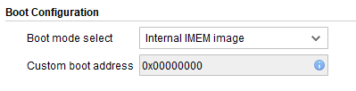
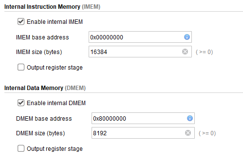

# SOC-FinalProject

### Note

> It is recommended you [install the toolchain](#compiling-toolchain) in VirtualBox, before you continue > to read the setup because it takes ~1 Hour or more.

# Hardware Setup 

## Setup NEORV32 IP

### Prerequisites
Clone the NEORV32 repository close to your `C:` drive:
```bash
git clone https://github.com/stnolting/neorv32.git
```

### Steps
1. Open the TCL shell in Vivado via **Window → Tcl Console**

2. Navigate to the system integration folder:
```bash
cd C:/neorv32/rtl/system_integration
```

3. Execute the IP packaging script:
```bash
source neorv32_vivado_ip.tcl
```

4. A second Vivado instance will open automatically to package the IP — it will close on its own when done (Rarely Happens)

5. A new folder `neorv32_vivado_ip_work` will be created inside `neorv32/rtl/system_integration` containing the IP-packaging Vivado project

6. The `packaged_ip` sub-folder contains the actual IP module, which is automatically added to the project's IP repository (You might need to add it via the IP Catalog)

7. Find the NEORV32 in the **User Repository** section of the Vivado IP catalog

## Project Setup 
1. Create project using provided constraints file

2. Use part number `xc7s50csga324-1`

3. Use the provided .tcl script 
```bash
cd path/to/SOC-FinalProject
source ./final_project.tcl
```

## Source Control 
4. Save new .tcl file for source control
```bash
write_bd_tcl -force path/to/SOC-FinalProject/final_project.tcl 
```

# Software Setup 
This Workflow is different from what we have done throughout the year in that it does not need Vitis.  

## Compiling toolchain 

## Suggestions 
> I highly suggest building the toolchain and programming in a Linux envrionment 
> (VirtualBox machine via a shared folder). 

> If using Virtual Box, at this point you should add this repo and the `NEORV32` repo as a shared 
> folder for your Virtual Box.  

### Prerequisites
1. Install needed libs for Linux 
```bashrc
sudo apt install -y gawk make build-essential texinfo bison flex zlib1g-dev libgmp-dev libmpfr-dev libmpc-dev libexpat1-dev
```
### Steps ~1 Hr 
1. Clone and Build the GCC RISVC toolchain repository in Virtual Box 
(Should not be a shared folder, strange errors show up if you do this):
```bash
git clone https://github.com/riscv-collab/riscv-gnu-toolchain
cd riscv-gnu-toolchain
./configure --prefix=/opt/riscv --with-arch=rv32i --with-abi=ilp32
sudo make
```

2. Add the toolchain binaries to system PATH variable.
```bash 
echo 'export PATH=/opt/riscv/bin:$PATH' >> ~/.bashrc
source ~/.bashrc
```

3. Double check you modified the PATH var
```bash
echo $PATH
```

## Compiling application 
Use the makefile for task1 as an example

1. In the Makefile:
```bash
RISCV_PREFIX ?= riscv32-unknown-elf-
# If you are using Virtual Box this is most likely your neo path 
NEORV32_HOME ?= /media/sf_neorv32    
```

2. Run make command to build program
```bash
make clean_all exe
```

## Installing Program into ROM Memeory 

1. Using the GUI, make sure to select these options:





2. Regenerate and re-install the default IMEM initialization file so that it contains the image of your actual application firmware. Run this command from your application directory
```bash
make clean_all image install
```

3. Repackage IP from Project
```bash
cd /path/to/neorv32/rtl/system_integration
source ./neorv32_vivado_ip.tcl
```

4. Refresh IP Catalog and Re-run synthesis and bitstream

5. Program Board via Board Manager in Vivado 2025.1