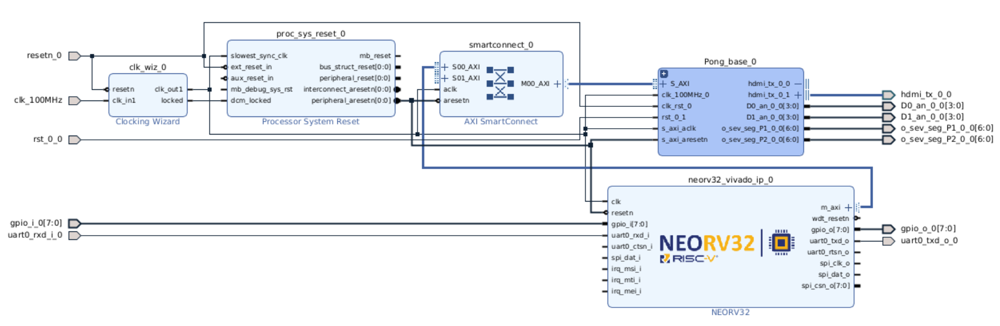

# Task 2-1 Pong game on NEORV32 Processor
## Overview
This project implements a two-player Pong game on the Urbana board using the NEORV32 soft-core processor. 
## System Architecture

The system consists of the following components:

- **NEORV32 Processor**
  - Reads GPIO button inputs
  - Controls paddle movement
  - Interfaces with memory-mapped registers

- **Pong IP Core**
  - Ball movement and collision detection
  - Paddle rendering
  - Score tracking
  - VGA signal generation

- **VGA Interface**
  - Displays game elements (ball, paddles, background)

- **GPIO Interface**
  - Provides real-time user input for both players
## Task directory Structure

```plaintext
task2/task_2_1/
├── docs/
│   └── results/
│       └── design_1_wrapper.bit     # bitstream
│
├── hw/
│   ├── neorv32_core/
│   │   ├── neorv32-main.zip         # Neorv32 soft core IP
│   │   └── neorv32_imem_image.vhd   # Embedded firmware image
│   ├── FP_Urbana_S2026_2_task2_1_v1.xdc      # Board Pin constraints
│   └── FP_task2_1_bd_new.tcl        # Block design run script
├── ip_repo/
│   ├── Pong_IP_base                 # Pong IP core
│   └── hdmi_tx_1.0                  # HDMI IP 
├── sw/
│   └── main_task2_1.c               # NEORV32-Pong application
└── README.md
```
## ⚙️ Build and Execution
## 1. Hardware
- **1.1 Pakaging NEORV32 IP**
  - Include firmware image ```task2_1/hw/neorv32_core/neorv32_imem_image.vhd ``` to ```nerorv32-main/rtl/core/```
  -  Rebuild Neor32 IP in Vivado:
    ```
    source neorv32-main/rtl/system_integration/neorv32_vivado_ip.tcl
    ```
- **1.2 create board design in Vivado**
  - Add ``` task_2_1/ip_repo``` and rebuilt neorv32 IP to user repository
  - Run ``` source task2_1/hw/FP_task2_1_bd_new.tcl ``` to create board design
  - create Bitstream using provided xcd file
    
    
## 2. Software
- copy ``` task_2_1/sw/main.c``` and ```task_2_1/hw/neorv32-main``` to where the toolchain has been installed.
- Edit makefile as necessory
  ```
  RISCV_PREFIX ?= riscv32-unknown-elf-
  NEORV32_HOME ?= /media/sf_msc/final_pr/task2_1/neorv32-main
  ```
- run following to generate ``` neorv32_imem_image.vhd``` :
  ```
  make clean_all exe
  make clean_all image install
  ```
- use the generated *.vhd image file to rebuild the Neorv32 IP in 1. Hardware section

## 🎮 Operation
- Connect HDMI display
- Use GPIO push buttons for paddle control
- Game starts automatically after configuration


